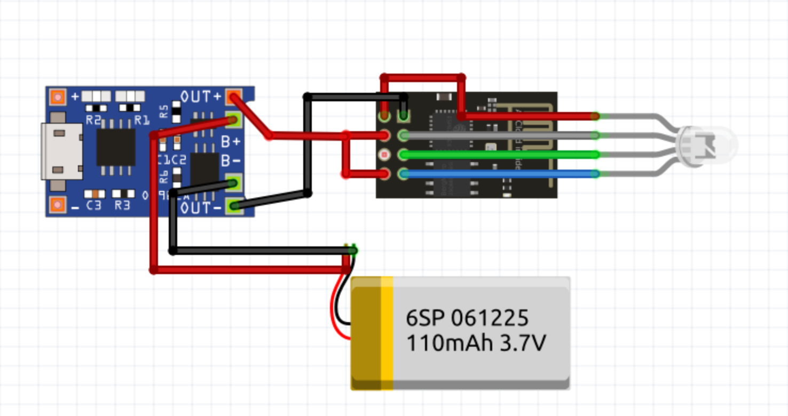
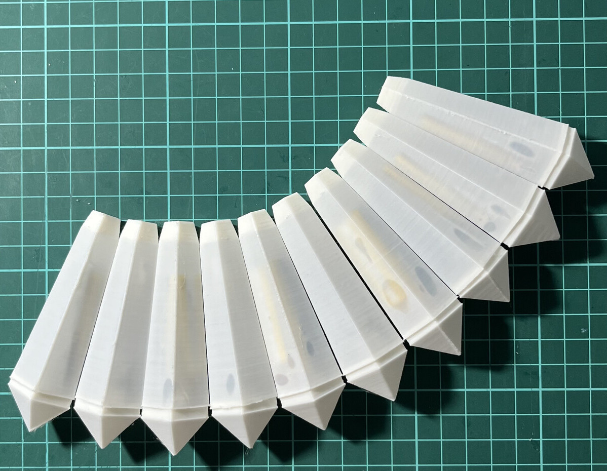

# Find your friends

Each `ESP01` board has a preprogrammed color that defines the person. The values from the array define the PWM values for R, G and B channels, and last it defines the fade effect speed:

```c
const int personValues[] = { 255, 100, 0, 30 };
```

Each board needs to be preprogrammed with the color you want it to send to another devices. When you sit next to another person, that person's board will fade with the color of your board, and your board will fade with the color from the other person.

## Electronics

The pinout arrangement was done in a way that simplifies the wiring procedure. Both boards are glued together near their pin holes, the battery is glued back on both boards and the RGB LED sits over the `ESP01` board, pointing to the WiFi antenna.



## Case

The case is a pentagon in form of a jewel, the [top](pendant-top.stl) part stores the boards, led and battery and the [bottom](pendant-bottom.stl) one is just a cap to make it look nice.


